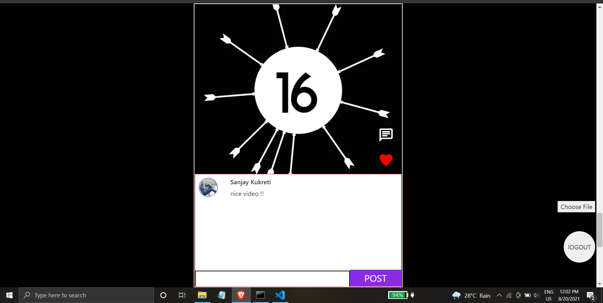

<h1>React_Insta_Reels</h1>

A reel clone build using reactjs

Having functionalities like :

USER AUTHENTICATION 💯

Allow user to upload reels ✌️

User can like and comment on reel. 💃

Firebase is used for realtime database and user authentication

